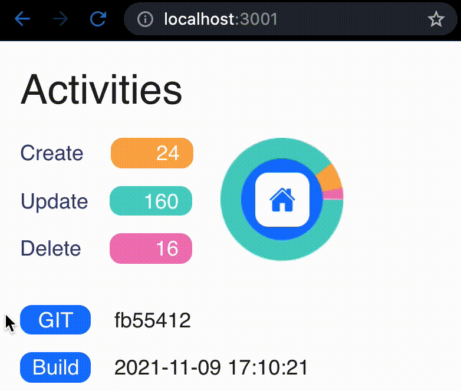
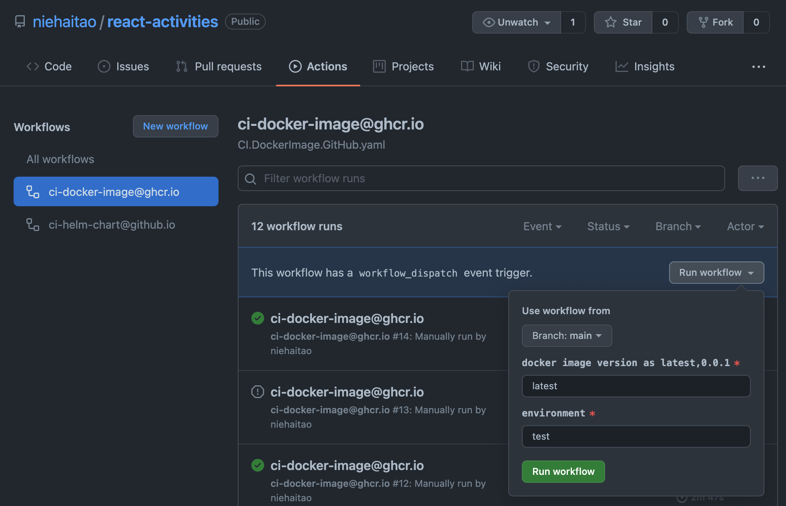
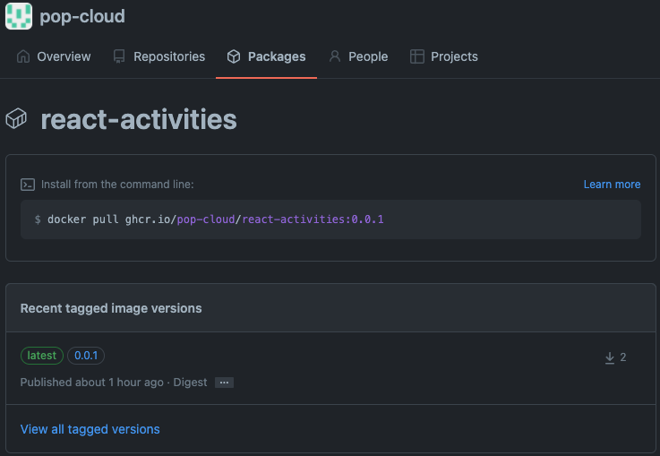

# Activities Web

**Activities Web** is a **React Application** which shows the _create/update/delete_ activities by fetching json data from an API.

|                 Application                  |                  Workflow                  |
| :------------------------------------------: | :----------------------------------------: |
|  |  |

This project uses GitHub Actions to build docker image and helm chart, and publish them. To get started:

| Application | Command                                                                                        | Check                                   |
| :---------: | :--------------------------------------------------------------------------------------------- | :-------------------------------------- |
|   docker    | `docker run --name my-react --rm -p 8080:80 ghcr.io/pop-cloud/activities-web:latest`           | http://localhost:8080/                  |
|     k8s     | `kubectl run my-react --image ghcr.io/pop-cloud/activities-web:latest`                         | `kubectl port-forward my-react 8080:80` |
|    helm     | `helm: helm upgrade -i my-react activities-web --repo https://pop-cloud.github.io/helm-charts` | http://localhost:8080/                  |


## 0. Local Rest API

In less than 30 seconds, we can fake a full REST API using the [json-server](https://github.com/typicode/json-server) from [a simple json file](https://raw.githubusercontent.com/niehaitao/niehaitao.github.io/main/applications/activities/db.json).

```bash
npm install -g json-server

json-server https://raw.githubusercontent.com/niehaitao/niehaitao.github.io/main/applications/activities/db.json --port 8081 --delay 3000

curl -X GET 'http://localhost:8081/activities'
# { "create": 24, "update": 160, "delete": 16 }

docker run -p 8081:80 -v ${db_file}:/data/db.json --name api --network act --rm clue/json-server
```

## 1. Local Dockerizing

```bash
docker build . \
  -f ops/docker/app.dockerfile \
  --build-arg ENV='test' \
  --build-arg BUILD="$(date "+%F %H:%M:%S")" \
  --build-arg GIT_HASH="$(git rev-parse --short HEAD)" \
  -t act-web
docker run -p 8082:80 --name web --network act --rm act-web:latest
```

## 2. Remote Dockerizing

|                 Build                  |                  Registry                  |
| ------------------------------------------: | :---------------------------------------- |
| Using [GitHub Action](https://github.com/niehaitao/activities-web/actions)| [`ghcr.io/pop-cloud/activities-web`](https://github.com/orgs/pop-cloud/packages/container/package/activities-web) |
|  | |


## References

- [Docker React App](https://www.bogotobogo.com/DevOps/Docker/Docker-React-App.php)
- [Dockerize React App + Nginx](https://www.freecodecamp.org/news/how-to-implement-runtime-environment-variables-with-create-react-app-docker-and-nginx-7f9d42a91d70/)
- [Dockerize series](https://dev.to/karanpratapsingh/series/13483)
