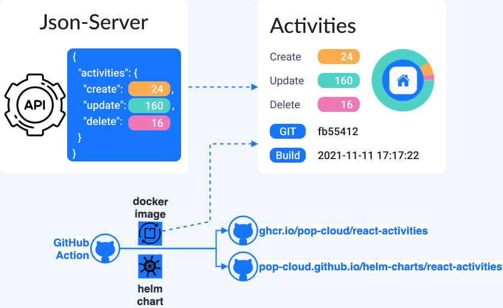

# React Activities

**React Activities** is a simple **React Application** running a simple **Release Process**.
> 

## TL;DR

```bash
docker pull ghcr.io/pop-cloud/react-activities:latest
docker run --name my-react --rm -p 3000:3000 ghcr.io/pop-cloud/react-activities:latest
```

Open http://localhost:3000/

## 1. Local Dockerizing

```bash
docker build . \
  -f app.dockerfile \
  --build-arg API_URL='http://localhost:5000/activities' \
  --build-arg BUILD="$(date "+%F %H:%M:%S")" \
  --build-arg GIT_HASH="$(git rev-parse --short HEAD)" \
  -t react-activities
  
docker run --name my-react --rm -p 3000:3000 react-activities:latest

docker exec -it my-react /bin/sh
```

## 2. Remote Dockerizing
Using [GitHub Action](https://github.com/niehaitao/react-activities/actions)
- Automatic run for each push on master
- Manual run

<details>

> 

</details>

## 3. Docker Registry

[Docker Registry](https://github.com/orgs/pop-cloud/packages/container/package/react-activities) `ghcr.io/pop-cloud/react-activities`

<details>

> 

</details>

```bash
docker pull ghcr.io/pop-cloud/react-activities:0.0.1

docker run --name my-react --rm -p 3000:3000 react-activities:latest
```
Open http://localhost:3000/

## References

- [Docker React App](https://www.bogotobogo.com/DevOps/Docker/Docker-React-App.php)
- [Dockerize React App + Nginx](https://www.freecodecamp.org/news/how-to-implement-runtime-environment-variables-with-create-react-app-docker-and-nginx-7f9d42a91d70/)
- [Dockerize series](https://dev.to/karanpratapsingh/series/13483)