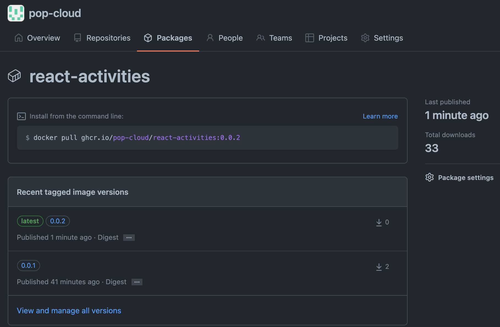

# Activities Web

**Activities Web** is a simple **React Application** running a simple **Release Process**.
> 

## TL;DR

```bash
docker pull ghcr.io/pop-cloud/activities-web:latest
docker run --name my-react --rm -p 8080:80 ghcr.io/pop-cloud/activities-web:latest
```

Open http://localhost:8080/

## 0. Local Rest API

We can use the [json-server](https://github.com/typicode/json-server) to fake a full REST API
from a simple [data/db.json](data/db.json) in less than 30 seconds 

```json
{ "activities": { "create": 24, "update": 160, "delete": 16 } }
```

```bash
npm install -g json-server

json-server --watch data/db.json --port 5000
```

## 1. Local Dockerizing

```bash
docker build . \
  -f ops/docker/app.dockerfile \
  --build-arg ENV='test' \
  --build-arg BUILD="$(date "+%F %H:%M:%S")" \
  --build-arg GIT_HASH="$(git rev-parse --short HEAD)" \
  -t act-web
docker run -p 8082:80   --name web --network act --rm act-web:latest
```

## 2. Remote Dockerizing
Using [GitHub Action](https://github.com/niehaitao/activities-web/actions)
- Automatic run for each push on master
- Manual run

<details>

> 

</details>

## 3. Docker Registry

[Docker Registry](https://github.com/orgs/pop-cloud/packages/container/package/activities-web) `ghcr.io/pop-cloud/activities-web`

<details>

> 

</details>

```bash
docker pull ghcr.io/pop-cloud/activities-web:latest
docker run --name my-react --rm -p 8080:80 ghcr.io/pop-cloud/activities-web:latest
```

## 4. Kubernetes

```bash
kubectl run my-react --image ghcr.io/pop-cloud/activities-web:latest
kubectl port-forward my-react 8080:80
```

## 5. Helm Chart

```bash
helm upgrade -i my-react activities-web --repo https://pop-cloud.github.io/helm-charts
```

## References

- [Docker React App](https://www.bogotobogo.com/DevOps/Docker/Docker-React-App.php)
- [Dockerize React App + Nginx](https://www.freecodecamp.org/news/how-to-implement-runtime-environment-variables-with-create-react-app-docker-and-nginx-7f9d42a91d70/)
- [Dockerize series](https://dev.to/karanpratapsingh/series/13483)